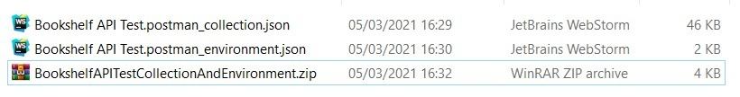
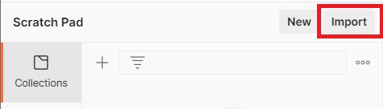
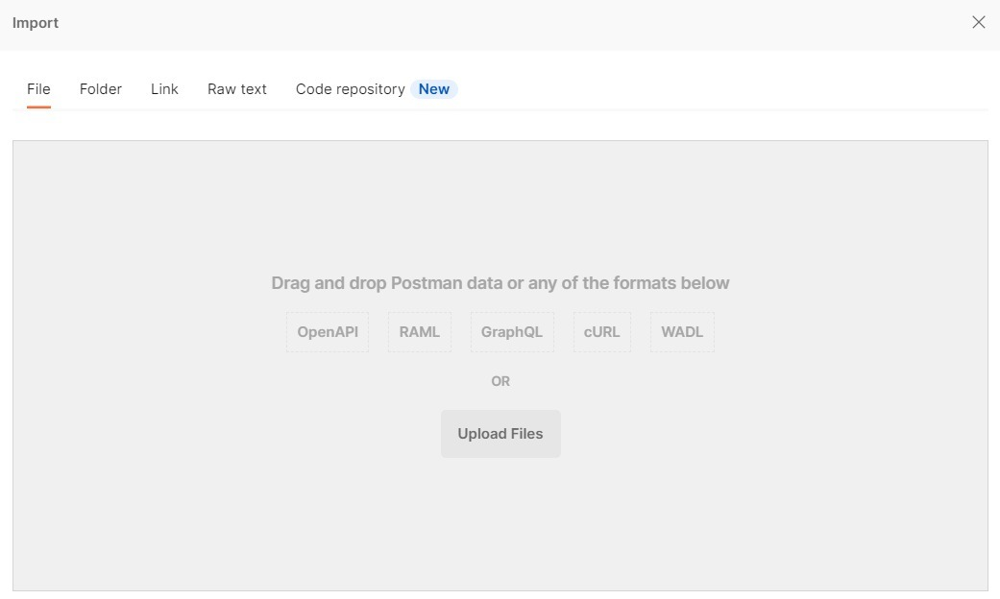
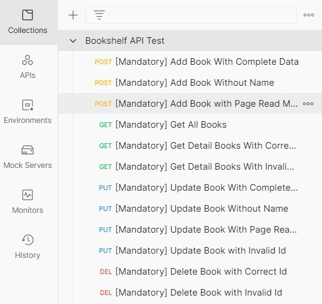

# Bookshelf-API

This project is an API for managing books. It provides endpoints for adding, retrieving, updating, and deleting books. The API allows users to perform operations such as adding a new book, retrieving all books, retrieving a specific book by ID, updating a book's information, and deleting a book.

# How To Use

The Waifu API allows you to manage a collection of waifus. You can perform operations like retrieving all waifus, adding a new waifu, updating a waifu, and deleting a waifu. Follow the instructions below to use the API effectively.

* Local Host: Run with Postman, local IP and Port:5000 `http://127.0.0.1:9000/waifus` or `http://localhost:9000`
* Online Domain : not deployed yet

To test the API endpoints using Postman, you can download the Postman Collection and Environment files from the following links:

- [Postman Bookshelf API Test Collection dan Environment](https://github.com/dicodingacademy/a261-backend-pemula-labs/raw/099-shared-files/BookshelfAPITestCollectionAndEnvironment.zip)

To use the files in Postman, you need to import both of them. To do this, extract the files that have been downloaded to produce two JSON files.



Then, in the Postman application, click on the import button located on the top-left panel of the Postman application.



Then click the "Upload Files" button to import both extracted JSON files.



After that, the Bookshelf API Test Collection and Environment will be available in your Postman. Now you can testing the API without typing the endpoints.



© [Dicoding Indonesia](https://www.dicoding.com/)

# Endpoint Routes

- ### **[GET]** Get All Books

To retrieve all books, send a `GET` request to `/books`. You can include optional query parameters to filter the books by `name`, `reading` status, and `finished` status.

Request:

```
**GET** /books
```

Response Body

* Success (HTTP 200 - OK):

  ```
  {
    "status": "success",
    "data": {
      "books": [
        {
          "id": "string",
          "name": "string",
          "publisher": "string"
        },
        ...
      ]
    }
  }
  ```

- ### **[GET]** Get a Book by ID

To retrieve a specific book by its ID, send a `GET` request to `/books/{bookId}`. Replace `{bookId}` in the endpoint with the actual ID of the book you want to retrieve.

Request:

```
**GET** /books/{bookId}

- bookId: ID of the book to retrieve.
```

Response Body :

* Success (HTTP 200 - OK):

  ```
  {
    "status": "success",
    "data": {
      "book": {
        "id": "string",
        "name": "string",
        "year": "number",
        "author": "string",
        "summary": "string",
        "publisher": "string",
        "pageCount": "number",
        "readPage": "number",
        "finished": "boolean",
        "reading": "boolean",
        "insertedAt": "string",
        "updatedAt": "string"
      }
    }
  }
  ```
* Client Error

  ```
  (HTTP 400 - Bad Request):

  Body:
  {
    "status": "fail",
    "message": "Gagal menambahkan buku. Mohon isi nama buku"
  }
  ```

- ### **[POST]** Add a Book

To add a new book, send a `POST` request to `/books` with the book details in the request body. Include the `name`, `year`, `author`, `summary`, `publisher`, `pageCount`, `readPage`, and `reading` properties of the book.

Request:

```
**POST** /books
```

Request Body:

```
{
  "name": "string",
  "year": "number",
  "author": "string",
  "summary": "string",
  "publisher": "string",
  "pageCount": "number",
  "readPage": "number",
  "reading": "boolean"
}
```

Response Body:

* Success (HTTP 201 - Created)

  ```
  {
    "status": "success",
    "message": "Buku berhasil ditambahkan",
    "data": {
      "bookId": "string"
    }
  }
  ```
* Client Error (HTTP 400 - Bad Request):

  ```
  {
    "status": "fail",
    "message": "Gagal menambahkan buku. Mohon isi nama buku"
  }
  ```

- ### **[PUT]** Update a Book by ID

To update a book's information, send a `PUT` request to `/books/{bookId}`. Replace `{bookId}` in the endpoint with the actual ID of the book you want to update. Include the updated `name`, `year`, `author`, `summary`, `publisher`, `pageCount`, `readPage`, and `reading` properties of the book in the request body.

Request:

```
**PUT** /books/{bookId}

- bookId: ID of the book to update.
```

Request Body:

```
{
  "name": "string",
  "year": "number",
  "author": "string",
  "summary": "string",
  "publisher": "string",
  "pageCount": "number",
  "readPage": "number",
  "reading": "boolean"
}
```

Response Body:

* Success (HTTP 200 - OK):

  ```
  {
    "status": "success",
    "message": "Buku berhasil diperbarui"
  }
  ```
* Client Error (HTTP 400 - Bad Request):

  ```
  {
    "status": "fail",
    "message": "Gagal memperbarui buku. Mohon isi nama buku"
  }
  ```
* Client Error (HTTP 404 - Not Found):

  ```
  {
    "status": "fail",
    "message": "Gagal memperbarui buku. Id tidak ditemukan"
  }
  ```

- ### **[DELETE]** Delete a Book by ID

To delete a book by its ID, send a `DELETE` request to `/books/{bookId}`. Replace `{bookId}` in the endpoint with the actual ID of the book you want to delete.

Request:

```
**DELETE** /books/{bookId}

- bookId: ID of the book to delete.
```

Response Body:

* Success (HTTP 200 - OK):

  ```
  {
    "status": "success",
    "message": "Buku berhasil dihapus"
  }
  ```
* Client Error (HTTP 404 - Not Found):

  ```
  {
    "status": "fail",
    "message": "Buku gagal dihapus. Id tidak ditemukan"
  }
  ```
